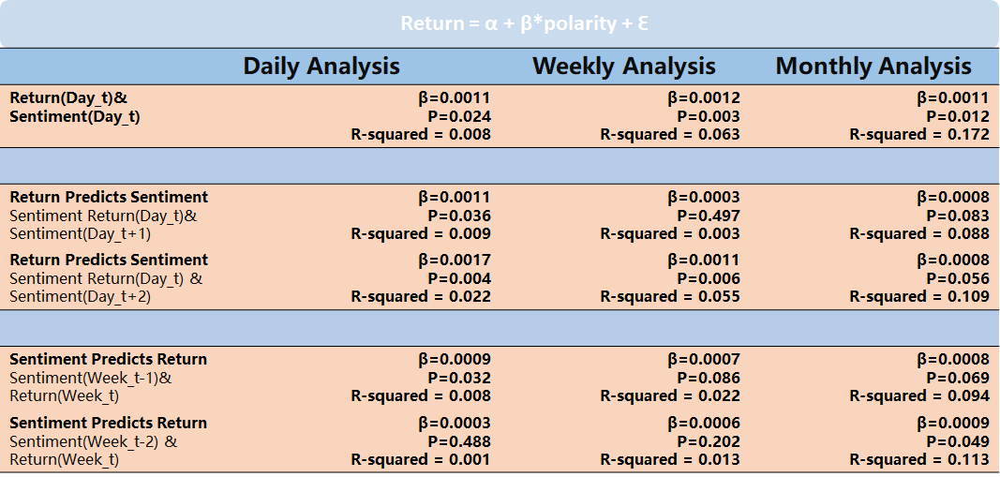

# 1 Why regression?
About regression, we tried to find the implicit relationship between sentiment and stock return. According to our intuition, we surely know that sentiment will have impact on stock return, and at the same time, stock return will also affect sentiment. To explore such relationship between the two, we ran regression.

# 2 How to run regression? Interval(daily? weekly? monthly?)
The most intuitive idea came to our mind was that return would have correlation with sentiment within the same day. It would not be hard for us to get the result, but the problem is that how to evaluate our result?  Probably we need to run more regression with different dataset and compare them.

## 2.1 Sentiment Calculation
> Daily
To sum up the whole day's sentiment polarity, we need to finish two steps:
- Step 1 - Transfer the time zone from GMT+0 to US.
- Step 2 - We define twitter sentiment from 16:00PM(day_t) to 16:00PM(dat_t+1) as an intact daily sentiment; for easier calculation, we shift the tweet's time 8 hours later so that we can sum up the whole day's sentiment just by the 'groupby'(method) the 'Date'.
- code 
```python
def polarity_calculation(df_data, trading_timezone, trading_timeshift):     
    
    # convert string to timestamp (e.g. "2020-01-13T16:21:57.000Z" to Timestamp('2020-01-13 16:21:57'))
    df_data['Date'] = [" ".join(line.split("T")).rstrip("Z") for line in df_data.Timestamp]
    df_data['Date'] = [datetime.strptime(line, '%Y-%m-%d %H:%M:%S.%f') for line in df_data.Date]
    
    # change to stock trading timezone
    timezone = pytz.timezone("Europe/London") # original time zone
    df_data['Date'] = [timezone.localize(line) for line in df_data.Date]
    df_data['Date'] = [line.astimezone(pytz.timezone(trading_timezone)) for line in df_data.Date]
    df_data['Date'] = [line+timedelta(hours=int(trading_timeshift)) for line in df_data.Date]
    
    
    df_daily_polarity = df_data.groupby([df_data['Date'].dt.date])['NLTK_Vader_polarity_score'].sum().reset_index()
    df_daily_polarity['polarity_change'] = df_daily_polarity['NLTK_Vader_polarity_score']-df_daily_polarity['NLTK_Vader_polarity_score'].shift(1)
    # df_daily_count = df.groupby([df['Date'].dt.date, 'NLTK_Vader_polarity']).count()
    
    # Specific on BiliBli, one month before LIST
    start_date_obj = datetime.strptime('2018-2-28', '%Y-%m-%d').date()
    df_daily_polarity = df_daily_polarity[df_daily_polarity.Date >= start_date_obj] 

    df_daily_polarity.dropna(subset = ["Date"], inplace=True)
    

    return df_daily_polarity
```
> Weekly
- After trimming the daily data, we can just leverage the 'isocalendar' method to add up the whole week's sentiment.
- code
```python
df_daily_polarity["year_week"] = [date.isocalendar()[:2] for date in df_daily_polarity.Date] 
df_weekly_polarity = ((df_daily_polarity.groupby(["year_week"])
                         ).apply(lambda x: pd.Series({'weekly_score': x['NLTK_Vader_polarity_score'].sum()}))
                       ).reset_index() 
```
> Monthly
- We also directly utilize DatetimeIndex.to_period('M') to accumulate the monthly data
- code
```python
df_monthly_polarity = df_daily_polarity.groupby(pd.DatetimeIndex(df_daily_polarity.Date).to_period("M")) \
                           .apply(lambda x: pd.Series({'monthly_score': x['NLTK_Vader_polarity_score'].sum()})).reset_index()  
```

## 2.1 Return Calculation
> daily
- return is calculated between two successive trading days' close price
```python
def return_calculation(df_stock):
    daily_return = [0,]
    length = len(df_stock['Adj Close'])
    
    for price in range(1,length):
        result = (df_stock['Adj Close'][price]-df_stock['Adj Close'][price-1]
                  )/df_stock['Adj Close'][price-1]
        daily_return.append(result)
        
    df_stock['Date'] = [datetime.strptime(d, '%Y-%m-%d').date() for d in df_stock['Date']]  
    df_stock['daily_return'] = pd.Series(daily_return)
    
    return df_stock
```
> weekly
- Very similar to the method used in sentiment calculation
- code
```python
df_daily_return["year_week"] = [date.isocalendar()[:2] for date in df_daily_return.Date] 
df_weekly_return = ((df_daily_return.groupby(["year_week"])
                             ).apply(lambda x: pd.Series({'weekly_cum_ret': ((x['daily_return'] + 1).product()-1)}))
                           ).reset_index() 
```
> monthly
- Very similar to the method used in sentiment calculation
- code
```python
df_monthly_return = df_daily_return.groupby(pd.DatetimeIndex(df_daily_return.Date).to_period("M")) \
                         .apply(lambda x: pd.Series({'monthly_cum_ret': ((x['daily_return'] + 1).product()-1)})).reset_index() 
```
# regression
- Example: plot the daily sentiment and return 


- Will current return affect future sentiment more or current return is affected by previous sentiment more? In our model, to testify the former argument, we need to shift our daily stock return by one row in the DataFrame to match previous return with current sentiment, and to testify the latter one, we need to shift the sentiment column. Besides, to know whether the correlation between daily return and daily sentiment is strong enough or not, we also tried to explore the correlation based on weekly cumulative data and monthly cumulative data.

- codes
> daily ```sentiment and return within the same day```
```python
df_daily = pd.merge(df_daily_return, df_daily_polarity, how='outer', on=['Date']).sort_values(by='Date')  
graphical_regression(df_daily, time_series='Date', y_return='daily_return', y_score='NLTK_Vader_polarity_score')
OLS_regression(df_daily, dep_variable='daily_return', indep_variable='NLTK_Vader_polarity_score')
```
> daily ```sentiment(one day ago) affects the current return```
```python 
df_daily = lag_strategy(df_daily_return, df_daily_polarity, merge_on='Date',
                           shift_column='NLTK_Vader_polarity_score', shift_mode='lag', shift_period=1)
graphical_regression(df_daily, time_series='Date', y_return='daily_return', y_score='NLTK_Vader_polarity_score_lag1')
OLS_regression(df_daily, dep_variable='daily_return', indep_variable='NLTK_Vader_polarity_score_lag1')
```
> daily ```sentiment(two day ago) affects the current return```
```python 
df_daily = lag_strategy(df_daily_return, df_daily_polarity, merge_on='Date',
                           shift_column='NLTK_Vader_polarity_score', shift_mode='lag', shift_period=2)
graphical_regression(df_daily, time_series='Date', y_return='daily_return', y_score='NLTK_Vader_polarity_score_lag2')
OLS_regression(df_daily, dep_variable='daily_return', indep_variable='NLTK_Vader_polarity_score_lag2')
```
> daily ```current return affects the sentiment(one day after)```
```python
df_daily = lag_strategy(df_daily_return, df_daily_polarity, merge_on='Date',
                           shift_column='daily_return', shift_mode='lag', shift_period=1)
 graphical_regression(df_daily, time_series='Date', y_return='daily_return_lag1', y_score='NLTK_Vader_polarity_score')
OLS_regression(df_daily, dep_variable='daily_return_lag1', indep_variable='NLTK_Vader_polarity_score')
```
> daily ```current return affects the sentiment(two days after)```
```python
df_daily = lag_strategy(df_daily_return, df_daily_polarity, merge_on='Date',
                           shift_column='daily_return', shift_mode='lag', shift_period=2)
graphical_regression(df_daily, time_series='Date', y_return='daily_return_lag2', y_score='NLTK_Vader_polarity_score')
OLS_regression(df_daily, dep_variable='daily_return_lag2', indep_variable='NLTK_Vader_polarity_score')
```
- weekly and monthly data can be processed like daily data

- regression result


# How can we analyze our regression result?
- From the above picture, we could see that the positive correlation between current monthly return and current monthly sentiment is the most significant, but if we take a look at the result of the daily data, we would also find that within the same day, sentiment and return has significant correlation. However, the most significant relationship could be found in return predicting sentiment, which means that the following several days' sentiment could be highly correlated with current day's return.

# Next thing to do:
- We would like to use back-testing method to form our own trading strategy.

