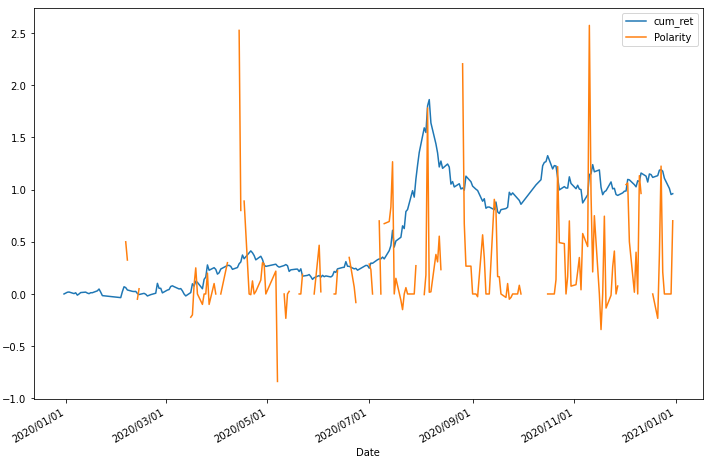
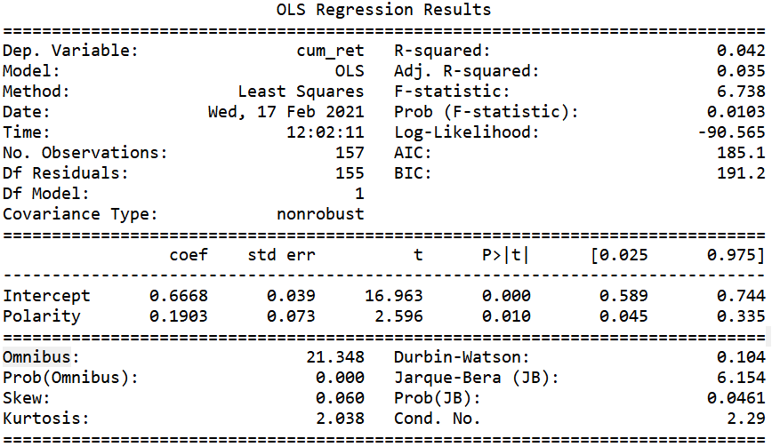

# Regression with Sentiment Polarity Scores

With the sentiment polarity scores obtained from Text Processing and Sentiment Analysis procedure, we are now going to investigate the relationship between the returns and the sentiment polarity scores. 


## 1 Data Preparation


### 1.1 Daily Sentiment Polarity Scores

```python
def polarity_calculation(df_data):
    Date = []
    for each in df_data['Timestamp']:
        date = each.split('T')[0]
        date = datetime.strptime(date, '%Y-%m-%d').date()
        Date.append(date)
    
    df_data['Date'] = pd.Series(Date)
    df_polarity = (df_data.groupby(['Date']).apply(lambda x: pd.Series({'Polarity': x['TextBlob_polarity'].sum()}))
                   ).reset_index()
        
    return df_polarity
```


### 1.2 Daily Stock Returns and Cumulative Stock Returns

```python
def return_calculation(df_stock):
    daily_return = [0,]
    length = len(df_stock['Adj Close'])
    
    for line in range(1,length):
        result = (df_stock['Adj Close'][line]-df_stock['Adj Close'][line-1]
                  )/df_stock['Adj Close'][line-1]
        daily_return.append(result)
        
    df_stock['Date'] = [datetime.strptime(d, '%Y-%m-%d').date() for d in df_stock['Date']]  
    df_stock['daily_return'] = pd.Series(daily_return)
    df_stock['cum_ret'] = (df_stock['daily_return'] + 1).cumprod()-1
    
    return df_stock
```


## 2 Regression method

We use graphical method and OLS method at the first attempt.


## 3 Regression Result

<div align=center></div>

From the graphical method, we can clearly see the stock cumulative return is affected by the sentiment polarity. On some days, the positive and high sentiment polarity score is followed by the jump of the stock cumulative return.


<div align=center></div>

From OLD method, the R-Squared value and the probability of Omnibus are very low, which means OLD method is not very suitable for our data. We cannot conclude any findings from OLD method.
