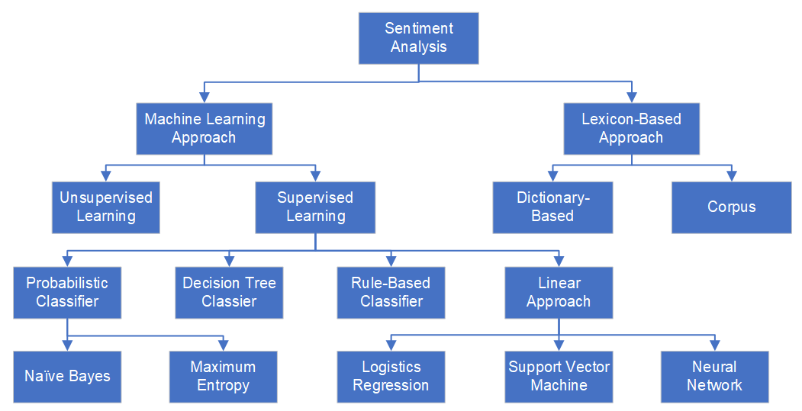

# Machine learning approaches: Build NB, LR, SVM models

Machine learning is another feasible way for sentiment analysis. In the machine learning method, the unigrams or their combinations (N-grams) will be used as features for the classifiers. (Kolchyna et al., 2015)

<div align=center></div>

There are a lot of machine learning models are available from scikit-learn package in python library. We build three main models, Naïve Bayes Model, Logistics Regression Model and SVM Model, to predict the sentiment of tweets. All of them belong to supervised learning models. Naïve Bayes is based on a probabilistic classifier whereas Logistics Regression and SVM are linear approaches. 

We start from the twitter dataset of Fosun Pharma. We use the processed texts as the input data for the machine learning models. 

After calculating the accuracies of these three models, we will use the most efficient model to predict the sentiment of tweets in other dataset. 

## 1. Generate Training Dataset

```python
def get_feature_vector(train_fit):
    vector = TfidfVectorizer(sublinear_tf=True)
    vector.fit(train_fit)
    return vector

def ML_train_dataset(df_text, df_target):
    # df_text and df_target are columns of a dataframe

    # tf_vector will be used for Testing sentiments on unseen trending data
    tf_vector = get_feature_vector(np.array(df_text.dropna()).ravel())
    X = tf_vector.transform(np.array(df_text.dropna()).ravel())
    #target
    y = np.array(df_target.dropna()).ravel()
    # Split dataset into Train, Test
    X_train, X_test, y_train, y_test = train_test_split(X, y, test_size=0.33, random_state=42)
    
    return tf_vector, X_train, X_test, y_train, y_test
```

After Fitting the vectorizer to the training data and save the vectorizer to a variable, the variable output from `fit()` is transformed to validation data by `transform()`. The validation data and the target data will be splited into two parts. 

After training the train part by the following three machine learning models, the accuracy of each model will be calculated based on the prediction results of the test part. The `test_size` and `random_state` are set to be 0.33 and 42 respectively, and later will be tested with other input values.

The variable `tf_vector` will also further be used to predict unseen trending data from other dataset.


## 2. Machine Learning Models

### 2.1 Naïve Bayes Model

Naïve Bayes is a generative model and assumes all the features to be conditionally independent. So, if some of the features are in fact dependent on each other, the prediction might be poor.(Ottesen, 2017)

```python
def Naive_Bayes_model(df_test_text, df_training_text, df_training_target):
        
    tf_vector, X_train, X_test, y_train, y_test = ML_train_dataset(df_training_text, df_training_target)
    
    # Training Naive Bayes model
    NB_model = MultinomialNB()
    NB_model.fit(X_train, y_train)
    
    # Accuracy of the trained data
    y_predict_nb = NB_model.predict(X_test)
    print('Training accuracy of Naive Bayes model is: ', accuracy_score(y_test, y_predict_nb))
        
    # Prediction on Real-time Feeds
    test_feature = tf_vector.transform(np.array(df_test_text).ravel())
    prediction_nb = NB_model.predict(test_feature)
    
    return prediction_nb

```

## 2.2 Logistics Regression Model

Logistic regression is a discriminative model which splits feature space linearly, and works reasonably well when some of the variables are correlated. Logistic regression can have different decision boundaries with different weights that are near the optimal point.(Ottesen, 2017)

```python
def Logistics_Regression_model(df_test_text, df_training_text, df_training_target):
    
    tf_vector, X_train, X_test, y_train, y_test = ML_train_dataset(df_training_text, df_training_target)
    
    # Training Logistics Regression model
    LR_model = LogisticRegression(solver='lbfgs')
    LR_model.fit(X_train, y_train)
    
    # Accuracy of the trained data
    y_predict_lr = LR_model.predict(X_test)
    print('Training accuracy of Logistics Regression model is: ', accuracy_score(y_test, y_predict_lr))
    
    # Prediction  
    test_feature = tf_vector.transform(np.array(df_test_text).ravel())
    prediction_lr = LR_model.predict(test_feature)
    
    return prediction_lr

```

## 2.3 SVM Model

SVM tries to finds the “best” margin (distance between the line and the support vectors) that separates the classes and this reduces the risk of error on the data.(Bassey, 2019)

```python
def Support_Vector_Machines(df_test_text, df_training_text, df_training_target):
    
    tf_vector, X_train, X_test, y_train, y_test = ML_train_dataset(df_training_text, df_training_target)

    # Training SVM model
    SVC_model = SVC()
    SVC_model.fit(X_train, y_train)
    
    # Accuracy of the trained data
    y_predict_svc = SVC_model.predict(X_test)
    print('Training accuracy of Support Vector Machines is:', accuracy_score(y_test, y_predict_svc))
    
    # Prediction 
    test_feature = tf_vector.transform(np.array(df_test_text).ravel())
    prediction_svc = SVC_model.predict(test_feature)
    
    return prediction_svc
```

## 3. Accuracies of Three Models

### 3.1 Accuracies on the testing part

|                      | test_size = 0.33，random_state = 42 | test_size = 0.33，random_state = 30 | test_size = 0.20，random_state = 42 |
| -------------------- | :---------------------------------: | :---------------------------------: | :---------------------------------: |
| Naïve Bayes          | 76.01%                              | 76.01%                              | 77.78%                              |
| Logistics Regression | 72.78%                              | 74.66%                              | 78.67%                              |
| SVM                  | 73.32%                              | 73.05%                              | 75.11%                              |

While training the models, we need to set a testing size and a random state. 
We find that the smaller the testing size is, the more accurate results will be produced. The accuracy of the Logistics Regression model is most affected by this factor. In addition, the influence of random state is not significant.


### 3.2 Accuracies on all the whole dataset

|                      | test_size = 0.33, random_state = 42 | test_size = 0.33, random_state = 30 | test_size = 0.20, random_state = 42 |
| :------------------: | :---------------------------------: | :---------------------------------: | :---------------------------------: |
| Naïve Bayes          | 85.13%                              | 84.51%                              | 86.64%                              |
| Logistics Regression | 84.77%                              | 84.77%                              | 87.53%                              |
| SVM                  | 88.60%                              | 88.60%                              | 92.16%                              |

The accuracies are very high because the trained dataset is the same as the target dataset.


## References

1. Kolchyna, O., Souza, T., Treleaven, P., Aste, T. (2015) , *Twitter Sentiment Analysis: Lexicon Method, Machine Learning Method and Their Combination*, viewed 12 March 2011, <https://arxiv.org/abs/1507.00955>.

2. Ottesen, C. 2017, *Comparison between Naïve Bayes and Logistic Regression*, viewed 11 March 2011, <https://dataespresso.com/en/2017/10/24/comparison-between-naive-bayes-and-logistic-regression/>.

3. Bassey, P. 2019, *Logistic Regression Vs Support Vector Machines (SVM)*,  viewed 11 March 2011, <https://medium.com/axum-labs/logistic-regression-vs-support-vector-machines-svm-c335610a3d16>.