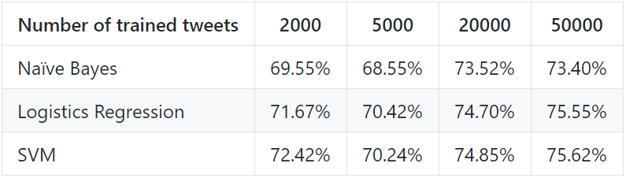
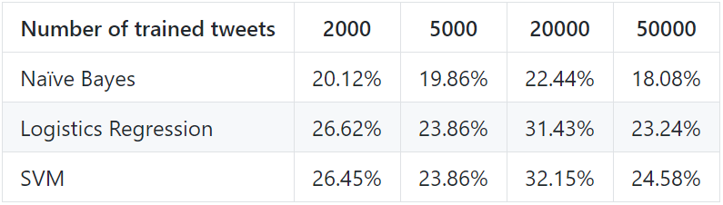

# Machine learning approaches: Prediction based on a big dataset

Previously, we built three machine learning models to predict the sentiment of tweets of Fosun Pharma in 2020. We splitted the training dataset to train part and test part, and calculated the accuracy of sentiment prediction of the tweets in the test part for each model. We are now training the models with a big dataset with 1.6 million tweets and then testing their performance for sentiment prediction of all tweets of Fosun Pharma in 2020.

## 1. Training Dataset

The big dataset is Sentiment140, one of the most popular tweet training dataset. It can be viewed from [dataset](https://github.com/Insight-Group/MFIN7036/tree/master/dataset/training.csv).

We tried to train the three machine learning models use all the 1.6 million tweets from this dataset, but it takes more than 24 hours to be preprocessed and studied by the machine learning models. An alternative way is that training the models and calculate their accuracies by randomly selecting different amount of tweets from the big dataset. 

The testing size is set to be 0.33 and random state is 42 for all the models in all cases. 

## 2. Performance

### 2.1 Accuracies on the testing part

In general, the accuracies of all models can be improved by training with more tweets. However, the relationship is not linear. It depends on the quality of the trained tweets.

### 2.2 Accuracies on the 1123 tweets of Fosun Pharma in 2020

With a larger amount of trained tweets, the accuracies of all the three models does not improves as expected while judging the sentiment other twitter datasets. The model is trained to be more suitable for this dataset, it does not mean that it can be more suitable for judging the sentiment of other datasets. The accuracies of those trained by Fosun Pharma twitter dataset are all above 80%, much higher than those trained by this dataset.

