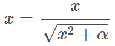

# Sentiment Analysis: NLTK Vader or TextBlob?

From previous sentiment analysis on tweets of Fosun Pharma in 2020, the sentiment polarity of the same tweet judged by *NLTK Vader* and *TextBlob* is very different. Besides, *NLTK Vader* cannot recognize the sentiment of tokenized words. This blog discusses the main differences between these two sentiment analysis approaches and shows the accuracy of them based on the tweets of Fosun Pharma in 2020.

## 1 Main Features

### 1.1 NLTK Vader

1. *NLTK Vader* is based on lexicon of sentiment-related words. Each words in the lexicon is rated whether it is positive or negative. There are 7052 words in its lexicon library "vader_lexicon.txt" with predetermined measures. 

2. When it comes to analysing comments or text from social media, the sentiment of the sentence changes when considering context. Vader takes this into account along with emoticons(e.g. smileys is included in its lexicon), punctuation emphasis(e.g. ??? and !!!), degree modifiers, capitalization, idoms, negation words, polarity shift due to conjunctions(e.g. but) etc and hence it is a better option when it comes to tweets analysis and their sentiments.

Example of relevant codes are shown as follows:

```python

def _least_check(self, valence, words_and_emoticons, i):
        # check for negation case using "least"
        if (
            i > 1
            and words_and_emoticons[i - 1].lower() not in self.lexicon
            and words_and_emoticons[i - 1].lower() == "least"
        ):
            if (
                words_and_emoticons[i - 2].lower() != "at"
                and words_and_emoticons[i - 2].lower() != "very"
            ):
                valence = valence * self.constants.N_SCALAR
        elif (
            i > 0
            and words_and_emoticons[i - 1].lower() not in self.lexicon
            and words_and_emoticons[i - 1].lower() == "least"
        ):
            valence = valence * self.constants.N_SCALAR
        return valence

    def _but_check(self, words_and_emoticons, sentiments):
        # {"but", "BUT"} & set(['you','but','me','BUT','me']) ==> {'BUT', 'but'}
        but = {"but", "BUT"} & set(words_and_emoticons)
        if but:
            # next(iter({'BUT', 'but'})) ==> 'BUT'
            bi = words_and_emoticons.index(next(iter(but)))
            for sidx, sentiment in enumerate(sentiments):
                if sidx < bi:
                    sentiments[sidx] = sentiment * 0.5
                elif sidx > bi:
                    sentiments[sidx] = sentiment * 1.5
        return sentiments

    def _idioms_check(self, valence, words_and_emoticons, i):
        # check word terms
        onezero = "{0} {1}".format(words_and_emoticons[i - 1], words_and_emoticons[i])

        twoonezero = "{0} {1} {2}".format(
            words_and_emoticons[i - 2],
            words_and_emoticons[i - 1],
            words_and_emoticons[i],
        )
        twoone = "{0} {1}".format(
            words_and_emoticons[i - 2], words_and_emoticons[i - 1]
        )
        threetwoone = "{0} {1} {2}".format(
            words_and_emoticons[i - 3],
            words_and_emoticons[i - 2],
            words_and_emoticons[i - 1],
        )
        threetwo = "{0} {1}".format(
            words_and_emoticons[i - 3], words_and_emoticons[i - 2]
        )
        sequences = [onezero, twoonezero, twoone, threetwoone, threetwo]

        for seq in sequences:
            if seq in self.constants.SPECIAL_CASE_IDIOMS:
                valence = self.constants.SPECIAL_CASE_IDIOMS[seq]
                break

        if len(words_and_emoticons) - 1 > i:
            zeroone = "{0} {1}".format(
                words_and_emoticons[i], words_and_emoticons[i + 1]
            )
            if zeroone in self.constants.SPECIAL_CASE_IDIOMS:
                valence = self.constants.SPECIAL_CASE_IDIOMS[zeroone]
        if len(words_and_emoticons) - 1 > i + 1:
            zeroonetwo = "{0} {1} {2}".format(
                words_and_emoticons[i],
                words_and_emoticons[i + 1],
                words_and_emoticons[i + 2],
            )
            if zeroonetwo in self.constants.SPECIAL_CASE_IDIOMS:
                valence = self.constants.SPECIAL_CASE_IDIOMS[zeroonetwo]

        # check for booster/dampener bi-grams such as 'sort of' or 'kind of'
        if threetwo in self.constants.BOOSTER_DICT or twoone in self.constants.BOOSTER_DICT:
            valence = valence + self.constants.B_DECR
        return valence

    def _never_check(self, valence, words_and_emoticons, start_i, i):
        # 'never' is a type of emphasize word
        if start_i == 0:
            if self.constants.negated([words_and_emoticons[i - 1]]):
                valence = valence * self.constants.N_SCALAR

        if start_i == 1:
            if words_and_emoticons[i - 2] == "never" and (
                words_and_emoticons[i - 1] == "so"
                or words_and_emoticons[i - 1] == "this"
            ):
                valence = valence * 1.5
            elif self.constants.negated([words_and_emoticons[i - (start_i + 1)]]):
                valence = valence * self.constants.N_SCALAR

        if start_i == 2:
            if (
                words_and_emoticons[i - 3] == "never"
                and (
                    words_and_emoticons[i - 2] == "so"
                    or words_and_emoticons[i - 2] == "this"
                )
                or (
                    words_and_emoticons[i - 1] == "so"
                    or words_and_emoticons[i - 1] == "this"
                )
            ):
                valence = valence * 1.25
            elif self.constants.negated([words_and_emoticons[i - (start_i + 1)]]):
                valence = valence * self.constants.N_SCALAR
        return valence

    def _punctuation_emphasis(self, sum_s, text):
        # add emphasis from exclamation points and question marks
        ep_amplifier = self._amplify_ep(text)
        qm_amplifier = self._amplify_qm(text)
        punct_emph_amplifier = ep_amplifier + qm_amplifier
        return punct_emph_amplifier

    def _amplify_ep(self, text):
        # check for added emphasis resulting from exclamation points (up to 4 of them)
        ep_count = text.count("!")
        if ep_count > 4:
            ep_count = 4
        # (empirically derived mean sentiment intensity rating increase for
        # exclamation points)
        ep_amplifier = ep_count * 0.292
        return ep_amplifier

    def _amplify_qm(self, text):
        # check for added emphasis resulting from question marks (2 or 3+)
        qm_count = text.count("?")
        qm_amplifier = 0
        if qm_count > 1:
            if qm_count <= 3:
                # (empirically derived mean sentiment intensity rating increase for
                # question marks)
                qm_amplifier = qm_count * 0.18
            else:
                qm_amplifier = 0.96
        return qm_amplifier
```

3. The compound score is computed by summing the valence scores of each word in the lexicon, adjusted according to the rules, and then normalized to be between -1 (most extreme negative) and +1 (most extreme positive). 

<div align=center></div>

   where x is sum of valence scores of words in the sentences, and α is normalization constant (default value is 15).


### 1.2 TextBlob

1. *TextBlob* also has a lexicon library, "en-sentiment.xml", an XML document that includes the different senses for the same word and identified by different ids. There are 2919 records collected by this lexicon library. *TextBlob* also handles negation (e.g. not) and modifier words (e.g very).

<div align=center></div>

2. *TextBlob* can identify different entities based on its entities library, "en-entities.txt" and tag phrases by Parts of Speech (POS).

3. When calculating sentiment for a single word, *TextBlob* simply takes average of different entries for the same word. *TextBlob* goes along finding words and phrases it can assign polarity and subjectivity to, and it averages them all together for longer text. (e.g. multiply polarity by negation's measure , the inverse intensity of the modifier enters for both polarity and subjectivity.)


### 1.3 Comparison and conclusion

Both of these two approaches analyze the text according to its lexicon library. *NLTK Vader* focus on analyze in context by considering the word terms and conjunctions, whereas *TextBlob* takes entities into consideration by POS. The tweets we collected are mainly about stocks, so POS may not be suitable for our data (e.g. AAPL is more likely to appear than Apple Inc., and the analysis on tags LOCATION and PERSON are not very meaningful). Besides, *NLTK Vader* also considers emoticons so it works better for texts from social media. 


## 2 Sentiment polarity scores

<div align=center></div>

Among 1123 tweets of Fosun Pharma in 2020, the result given by *NLTK Vader* is that 390(34.73%), 142(12.64%) and 591(52.63%) are positive, negative and neutral respectively, while *TextBlob* says that 291(25.91%), 100(8.90%) and 732(65.18%) are positive, negative and neutral respectively. 

Both of these two approaches conclude that positive sentiment in tweets is greater than negative sentiment. However, the numbers in each polarity scores class are not the same. More neutral are produced by *TextBlob*.

<div align=center></div>

200 of the 1123 tweets are recognized to be positive by both of these two approaches, and 29 and 492 are recognized to be negative and neutral. These two approaches have different results on the polarity of the remaining 402 tweets. *NLTK Vader* gives positive and negative sentiment score for the 151 and 89 tweets, but *TextBlob* says they are neutral. So, *NLTK Vader* seems to be more sensitive to our sample tweets than *TextBlob*.

After scoring these 402 tweets manually and comparing the results given by these two approaches, *NLTK Vader* gives the same sentiment score to 181 of the tweets whereas *TextBlob* gives the same sentiment score to 139 of the tweets.

In overall, the accuracy of *NLTK Vader* in judging the sentiment polarity of the 1123 tweets is **80.32%** and that of TextBlob is **76.58%**.
