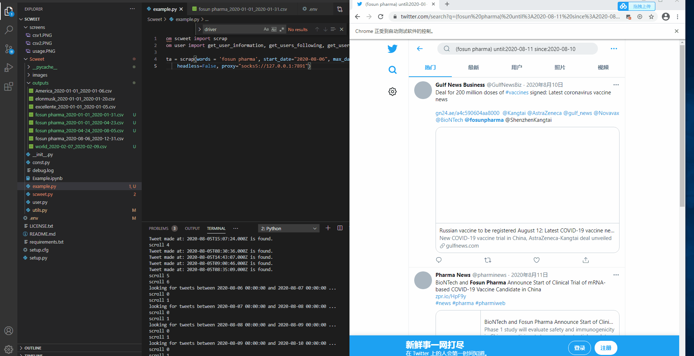

# Twitter Data Downloading - the Feasible Way

We talked about [Twint](https://github.com/twintproject/twint) and [GetOldTweets3](https://github.com/Mottl/GetOldTweets3) in the last post, and for some reasons, we cannot use them to fetch twitter historical data successfully. Luckily, we found another framework [Scweet](https://github.com/Altimis/Scweet) in an issue of Twint, and we got all data we wanted with it.

## 1 Installation

### Step 1 Download the repo

- git clone https://github.com/Altimis/Scweet.git

Since the framework is still in development, it is not published to any python package manager yet, we have to use its source code to run it.

### Step 2 Install Dependencies

- pip install -r requirements.txt

This is a typical python dependencies management method with a text file named `requirement.txt`.

## 2 Run

To download all tweets related to Amazon during the year 2020, using `example.py` as below:

```python
from scweet import scrap
 
data = scrap(
    # Keywords for query
    words = 'Amazon', 
    # Tweets language, here we just care about english tweets
    lang='en', 
    # Start date for search query
    start_date="2020-01-01",
    # End date for search query
    max_date="2021-01-01", 
    # Days between two query, 1 means search everyday without jump
    interval=1, 
    # True means show the operation on Chrome, False means hide operation background
    headless=True, 
    # Proxy settings for selenium webdriver, not needed if you are nott in mainland China
    proxy="socks5://127.0.0.1:7891", 
    # Resume the last scraping work, all parameters should be the same to last execution
    resume=False)
```

You can change the parameters of method `scrap` to do anything you want.

## 3 Troubleshooting

### 3.1 No Module named scweet

Your code should be placed in the structure:

```text
- Scweet
  - Scweet
    - scweet.py
    - example.py
  - screens
  - .env
```

Place the `example.py` near the `scweet.py`, and then the `from scweet import scrap` shall work.

But the framework may change in the future, you should adjust the structure accordingly.

### 3.2 Cannot fetch tweets without error

#### Make sure access twitter successfully

If you are in mainland China, you may face an access error to Twitter. You can set proxy parameters like the example above to make the internet access under proxy. But you need to know how to start a socks proxy service locally at first.

#### Make sure access Twitter advanced search function successfully

The program may run without any exception happens but just no tweets data downloaded. We ran into this situation because we must log in firstly and it's a pre-requisite for us to access the [Twitter Explore Page](`https://twitter.com/explore`) with [advanced search function](https://twitter.com/search?q=(world)%20until%3A2021-01-02%20since%3A2021-01-01&src=typed_query) that the framework used to do data scraping.

You can test whether you are forced to do so by accessing the [advanced search function](https://twitter.com/search?q=(world)%20until%3A2021-01-02%20since%3A2021-01-01&src=typed_query). If you are facing a search error, then you must log in to Twitter firstly. If not then you won't have the problem we talk about.

To login to Twitter before data scraping, add your Twitter username and password to the `.env` file list above.

```text
SCWEET_USERNAME=xxxx
SCWEET_PASSWORD=xxxx
```

### 3.3 The Silver Bullet

If you were in trouble using Scweet and could not figure out what happened, you can set the parameter `headless` to `False`, and then the application will run in a non-headless way. You can see all operations selenium does on the Chrome window, and you can quickly fix problems out by observing the web page directely.



## 4 Summary

The world is changing. Some frameworks work today may die tomorrow, especially in the web scrap field. It's an important capability for data miners to find newly issued frameworks or create a shiny new one - like the author of Scweet.

And once you find the right one, the following things become pretty simple. Just write several lines of code, waiting for hours for the data to be downloaded. Multi-thread and task-concurrency maybe a must when the data downloading is too big, but for now, we choose to just wait. [Here](https://github.com/Insight-Group/MFIN7036-Blog/tree/main/dataset) are some tweets dataset we downloaded with the help of Scweet.
